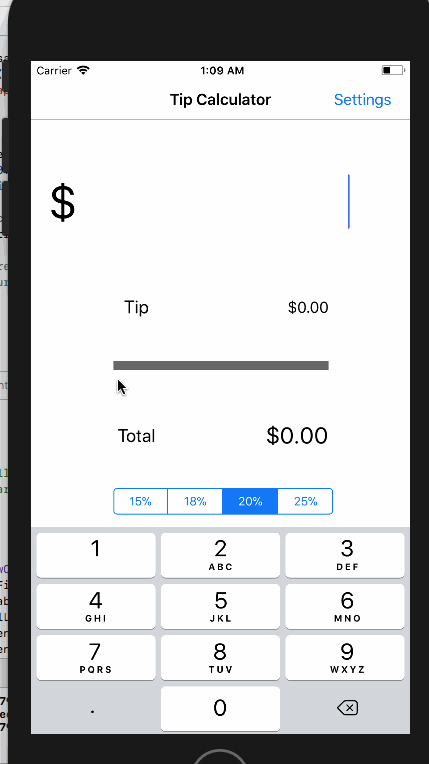

# Pre-work - *Tip?*

**Tip?** is a tip calculator application for iOS.

Submitted by: **Boubacar Diallo**

Time spent: **10** hours spent in total (so far)

## User Stories

The following **required** functionality is complete:

* [X] User can enter a bill amount, choose a tip percentage, and see the tip and total values.

The following **optional** features are implemented:
* [X] Settings page to change the default tip percentage.
* [ ] UI animations
* [ ] Remembering the bill amount across app restarts (if <10mins)
* [X] Using locale-specific currency
* [ ] Using currency thousands separators.
* [X] Making sure the keyboard is always visible and the bill amount is always the first responder. This way the user doesn't have to tap anywhere to use this app. Just launch the app and start typing.

The following **additional** features are implemented:

- [ ] List anything else that you can get done to improve the app functionality!

## Video Walkthrough 

Here's a walkthrough of implemented user stories:

GIF created with [LiceCap](http://www.cockos.com/licecap/).

## Notes
Learning how to use the environment in Xcode was the main challenge. By the end of the project I had a much better understanding of how to use each panel in the IDE to add functionality to the interface of the app.

## License

    Copyright [2018] [Boubacar Diallo]

    Licensed under the Apache License, Version 2.0 (the "License");
    you may not use this file except in compliance with the License.
    You may obtain a copy of the License at

        http://www.apache.org/licenses/LICENSE-2.0

    Unless required by applicable law or agreed to in writing, software
    distributed under the License is distributed on an "AS IS" BASIS,
    WITHOUT WARRANTIES OR CONDITIONS OF ANY KIND, either express or implied.
    See the License for the specific language governing permissions and
    limitations under the License.
